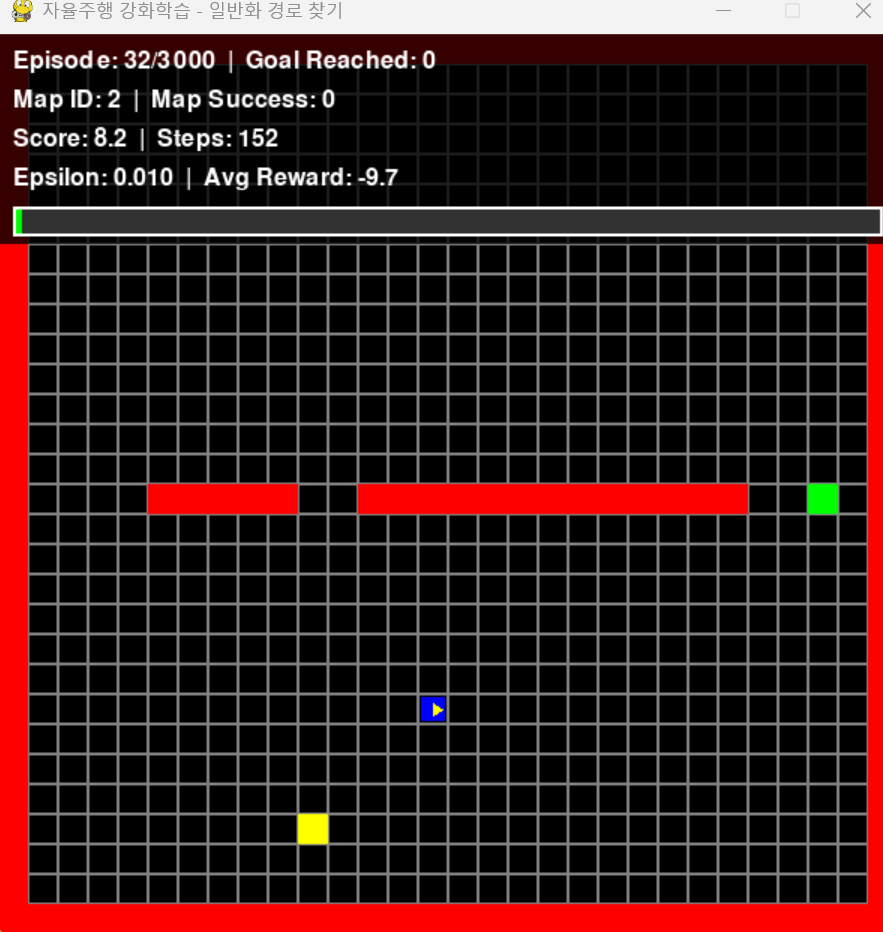

# 🚗 자율주행 강화학습 프로젝트

파이썬으로 만드는 간단한 2D 격자 기반 자율주행 시뮬레이터 + 과적합 문제 해결 과정 학습



## 📋 프로젝트 소개

**강화학습의 과적합(Overfitting) 문제를 단계적으로 해결하는 과정**을 보여주는 교육용 프로젝트입니다.

### 5가지 버전

1. **v1** - 과적합 문제가 있는 원본 버전 (문제점 확인용)
2. **v2** - 과적합 해결 버전 (경로 다양성 보상 추가)
3. **v3** - 완전한 일반화 버전 (여러 맵, 랜덤 시작점/목적지, **훈련셋/테스트셋 맵 분리**) ⭐
4. **v4** - 학습 속도 향상 버전 (Learning Rate Scheduling 적용) ⚡
   - 예시: 큰 보폭으로 넓은 범위를 탐색해 최적의 위치를 찾고, 그 위치에서만 작은 보폭으로 정밀하게 학습
5. **v5** - Policy > Cache 버전 (캐싱 시스템, 강화학습 철학 이해) 🧠
   - 핵심: 학습의 목적은 '최적 경로'가 아니라 '환경 적응력'

---

# 🚀 빠른 시작

## 1단계: 패키지 설치

**Python 버전:** Python 3.9 이상 권장 (현재 테스트: Python 3.14.2)

> 📌 **Python 3.9 사용자**: `requirements.txt`가 Python 3.9 호환 버전으로 설정되어 있습니다.

```bash
python -m pip install --upgrade pip
python -m pip install -r requirements.txt
```

> ⚠️ **Python 3.14**: `pygame` 대신 `pygame-ce` 사용

## 2단계: 실행

### 추천: v3 실행 (완전한 일반화) ⭐
```bash
cd simulator-v3
python train.py
```

### 빠른 학습: v4 실행 (학습 속도 향상) ⚡
```bash
cd simulator-v4
python train.py
```

### 학습 철학 이해: v5 실행 (Policy > Cache) 🧠
```bash
cd simulator-v5
python train.py
```

### 학습용: v1, v2 실행
```bash
cd simulator-v1  # 또는 simulator-v2
python train.py
```

## 3단계: 테스트

훈련 완료 후:
```bash
python main.py
```

**생성되는 파일:**
- `model_final.pth` - 학습된 모델
- `training_results.png` - 학습 그래프

---

# ⚡ 속도 조절 팁

## 화면 없이 빠르게 학습 (권장)

각 버전의 `config.py` 파일에서:
```python
SHOW_TRAINING = False  # 화면 표시 안함
```

**소요 시간:**
- v1, v2: ~5-10분 (500 에피소드)
- v3: ~10-30분 (3,000 에피소드)
- v4: ~7-20분 (3,000 에피소드) ⚡
- v5: ~7-20분 (3,000 에피소드) ⚡

**중요:** 화면 없이 실행하면 **FPS 제한 없이 CPU 최대 속도로 실행**됩니다!

## 화면 보면서 학습할 때

```python
CURRENT_SPEED = SPEED_NORMAL    # 30 FPS - 기본값
CURRENT_SPEED = SPEED_FAST      # 60 FPS - 빠르게
CURRENT_SPEED = SPEED_ULTRA     # 120 FPS - 초고속
```

---

# 📊 버전 비교

| 항목 | v1 | v2 | v3 | v4 | v5 |
|------|----|----|----|----|-----|
| **초기 방향** | 고정 | 랜덤 | 랜덤 | 랜덤 | 랜덤 |
| **경로 다양성 보상** | 없음 | 있음 | 있음 | 있음 | 있음 |
| **맵 개수** | 1개 | 1개 | 20개 이상 | 20개 이상 | 20개 이상 |
| **시작점/목적지** | 고정 | 고정 | 랜덤 | 랜덤 | 랜덤 |
| **일반화** | 불가능 | 제한적 | 완전 | 완전 | 완전 |
| **테스트셋 분리** | 없음 | 없음 | ✅ | ✅ | ✅ |
| **Learning Rate Scheduling** | 없음 | 없음 | 없음 | ✅ | ✅ |
| **캐싱 시스템 (Policy > Cache)** | 없음 | 없음 | 없음 | 없음 | ✅ |
| **학습 철학 이해** | 없음 | 없음 | 없음 | 없음 | ✅ |
| **학습 속도** | 느림 | 느림 | 보통 | ⚡ 빠름 | ⚡ 빠름 |

---

# 🎓 과적합 해결 기법 이해하기 (초보자용)

## 버전별 적용 기법

| 기법 | v1 | v2 | v3 | v4 | v5 |
|------|----|----|----|----|-----|
| **랜덤 초기 방향** | ❌ | ✅ | ✅ | ✅ | ✅ |
| **느린 Epsilon Decay** | ❌ | ✅ | ✅ | ✅ | ✅ |
| **Gradient Clipping** | ❌ | ✅ | ✅ | ✅ | ✅ |
| **경로 다양성 보상** | ❌ | ✅ | ✅ | ✅ | ✅ |
| **여러 맵 학습** | ❌ | ❌ | ✅ | ✅ | ✅ |
| **랜덤 시작점/목적지** | ❌ | ❌ | ✅ | ✅ | ✅ |
| **테스트셋 분리** | ❌ | ❌ | ✅ | ✅ | ✅ |
| **Learning Rate Scheduling** | ❌ | ❌ | ❌ | ✅ | ✅ |
| **캐싱 시스템 (Policy > Cache)** | ❌ | ❌ | ❌ | ❌ | ✅ |

---

## 1️⃣ 랜덤 초기 방향

**의미:** 매 에피소드마다 랜덤한 방향으로 시작

**v1:** ❌ 고정된 방향 (항상 위쪽) → 한쪽으로만 이동

**v2, v3, v4:** ✅ 랜덤한 방향 → 모든 방향 탐험 가능

**비유:** 매일 다른 방향으로 출발하면, 모든 방향의 길을 익힐 수 있습니다.

---

## 2️⃣ 느린 Epsilon Decay

**Epsilon = 탐험 확률** (랜덤하게 행동할 확률)

**v1:** ❌ 빠르게 감소 (0.995) → 탐험 시간 부족

**v2, v3, v4:** ✅ 느리게 감소 (0.998) → 충분한 탐험 시간

**비유:** 새로운 음식을 시도하는 시간을 늘리면, 다양한 맛을 경험할 수 있습니다.

---

## 3️⃣ Gradient Clipping (기울기 제한)

**Gradient = 기울기** (학습 시 얼마나 크게 업데이트할지 결정)

**v1:** ❌ 기울기 제한 없음 → 최적점을 넘어서 버림 (Overshooting)

**v2, v3, v4:** ✅ 기울기를 1.0으로 제한 → 안정적인 학습

**비유:** 자동차의 속도를 제한하면 안전하게 운전할 수 있습니다.

---

## 4️⃣ 경로 다양성 보상

**v1:** ❌ 경로 다양성 보상 없음 → 한 번 찾은 경로만 계속 사용

**v2, v3, v4:** ✅ 경로 다양성 보상 추가
- 새로운 위치 방문: +0.2 보상
- 같은 경로 반복: -0.1 패널티

**비유:** 새로운 장소를 방문하면 보너스를 주고, 같은 곳만 돌아다니면 패널티를 줍니다.

---

## 5️⃣ 여러 맵 학습 (v3, v4만)

**v1, v2:** ❌ 단일 맵 학습 → 일반화 불가능

**v3, v4:** ✅ 20개 이상의 다양한 맵에서 학습 → 완전한 일반화

**비유:** 여러 도시의 길을 익히면, 새로운 도시에서도 길을 찾을 수 있습니다.

---

## 6️⃣ 랜덤 시작점/목적지 (v3, v4만)

**v1, v2:** ❌ 고정된 시작점/목적지 → 특정 상황에만 특화

**v3, v4:** ✅ 매 에피소드마다 랜덤한 위치 → 다양한 상황 학습

**비유:** 여러 위치에서 출발해보면, 어디서든 목적지에 도달할 수 있습니다.

---

## 7️⃣ 테스트셋 분리 (v3, v4만)

**v1, v2:** ❌ 테스트셋 분리 없음 → 과적합 여부 확인 불가

**v3, v4:** ✅ 훈련에 사용하지 않은 새로운 맵에서 테스트 → 과적합 여부 정확히 검증

**비유:** 연습 문제와 시험 문제를 다르게 만들면, 진짜 실력을 알 수 있습니다.

---

## 8️⃣ Learning Rate Scheduling (v4만)

**학습률 = 보폭** (학습 시 얼마나 크게 이동할지)

**v1, v2, v3:** ❌ 고정된 학습률 → 학습 속도 느림

**v4:** ✅ 동적 학습률 조정
- 처음에는 큰 보폭으로 빠르게 탐색
- 손실이 적은 구간을 찾으면 작은 보폭으로 정밀하게 학습

**효과:** 학습 속도 향상 (v3 대비 약 20-30% 단축)

**비유:** 보물 찾기 - 넓은 지역을 빠르게 탐색하고, 보물이 있을 만한 지역에서 작은 보폭으로 정밀하게 탐색

---

## 9️⃣ 캐싱 시스템 (Policy > Cache) (v5만)

**캐싱 = 경험 메모** (실행 최적화, 학습 아님!)

**v1, v2, v3, v4:** ❌ 캐싱 없음 → 매번 새롭게 탐색

**v5:** ✅ 캐싱 시스템 추가
- 상태-행동 쌍을 메모에 저장
- **Policy > Cache 원칙**: 캐시는 힌트만, Policy가 최종 판단
- 동적 환경 대응: 환경이 변하면 Policy 우선

**중요한 차이점:**
- 캐싱 ≠ 학습
- 신경망 파라미터는 변경 안 됨
- 특정 맵에만 유효
- **학습 목적: 최적 경로 ❌ → 환경 적응력 ✅**

**비유:**
- 학습 = 운전 실력 향상 (뇌가 바뀜)
- 캐싱 = 특정 길 기억 (경험 메모)

**핵심 철학:**
> 학습된 정책은 물리적으로 더 빠르지 않다.
> '헤매는 시간'을 제거해서 더 빨리 도달한다.

---

# 📚 주요 용어 설명

## 과적합 (Overfitting)
- **의미**: 학습한 데이터에만 잘 맞고, 새로운 데이터에는 잘 안 맞는 현상
- **비유**: 시험 문제만 외워서 시험을 보면, 새로운 문제는 못 푸는 것

## 일반화 (Generalization)
- **의미**: 학습한 것과 다른 상황에서도 잘 작동하는 능력
- **비유**: 연습 문제로 배운 것을 새로운 문제에도 적용할 수 있는 것

## 테스트셋 분리
- **의미**: 훈련에 사용하지 않은 새로운 데이터로 테스트
- **이유**: 과적합 여부를 정확히 확인하기 위해
- **비유**: 연습 문제와 시험 문제를 다르게 만드는 것

## Gradient (기울기)
- **의미**: 신경망 학습 시 얼마나 크게 업데이트할지 결정하는 값
- **비유**: 산을 내려갈 때 걸음의 크기

## Learning Rate (학습률)
- **의미**: 학습 시 한 번에 얼마나 크게 이동할지 결정하는 값
- **비유**: 보폭의 크기

## Epsilon (탐험 확률)
- **의미**: 랜덤하게 행동할 확률
- **비유**: 새로운 음식을 시도할 확률

---

# 🎯 사용 권장사항

- **과적합 문제 학습**: `simulator-v1/` - 문제점 확인
- **과적합 해결 방법 학습**: `simulator-v2/` - 해결 기법 확인
- **실제 적용**: `simulator-v3/` - 완전한 일반화 버전 ⭐
- **빠른 학습**: `simulator-v4/` - Learning Rate Scheduling 적용 ⚡
- **학습 철학 이해**: `simulator-v5/` - Policy > Cache, 강화학습 본질 이해 🧠

---

# 📖 상세 실행 방법

## v1 실행 (과적합 문제 확인)

```bash
cd simulator-v1
python train.py
```

**조작키:** `ESC` - 훈련 중단

## v2 실행 (과적합 해결 확인)

```bash
cd simulator-v2
python train.py
```

**조작키:** `ESC` - 훈련 중단

## v3 실행 (완전한 일반화) ⭐

```bash
cd simulator-v3
python train.py
```

**조작키:** `ESC` - 훈련 중단

**테스트:** `python main.py` - 훈련에 사용하지 않은 새로운 맵에서 테스트

## v4 실행 (학습 속도 향상) ⚡

```bash
cd simulator-v4
python train.py
```

**조작키:** `ESC` - 훈련 중단

**테스트:** `python main.py` - 훈련에 사용하지 않은 새로운 맵에서 테스트

## v5 실행 (Policy > Cache, 학습 철학 이해) 🧠

```bash
cd simulator-v5
python train.py
```

**조작키:** `ESC` - 훈련 중단

**테스트:** `python main.py` - 훈련에 사용하지 않은 새로운 맵에서 테스트

**캐싱 활성화:** `config.py`에서 `USE_CACHE = True` 설정

**핵심 개념:**
- 학습 목적: 최적 경로 ❌ → 환경 적응력 ✅
- 캐싱: 학습 ❌ → 실행 최적화 ✅
- Policy > Cache: 캐시는 힌트만, Policy가 최종 판단

---

# 🔧 문제 해결

### 모델 파일이 없다고 나올 때
- `train.py`를 먼저 실행해야 합니다

### 학습이 너무 느릴 때
- `config.py`에서 `SHOW_TRAINING = False` 설정

### 패키지 오류
```bash
python -m pip install --upgrade pip
python -m pip install pygame-ce numpy torch matplotlib
```

---

# 📁 프로젝트 구조

```
python_lab/
├── README.md                    # 프로젝트 메인 설명
├── BOOK.md                      # 상세 학습 가이드 (전체 프로젝트 분석)
├── Gradient_용어정리.md         # Gradient 관련 용어 상세 설명
│
├── simulator-v1/                # v1: 과적합 문제가 있는 원본 버전
├── simulator-v2/                # v2: 과적합 해결 버전
├── simulator-v3/                # v3: 완전한 일반화 버전 ⭐
├── simulator-v4/                # v4: 학습 속도 향상 버전 ⚡
└── simulator-v5/                # v5: Policy > Cache 버전 🧠
```

각 버전 폴더에는:
- `README.md` - 버전별 상세 설명
- `config.py` - 설정 파일
- `train.py` - 훈련 스크립트
- `main.py` - 테스트 스크립트

---

# 💡 학습 순서 추천

1. **v1 실행** → 과적합 문제 확인
2. **v2 실행** → 해결 방법 확인
3. **v3 실행** → 완전한 일반화 확인
4. **v4 실행** → 학습 속도 향상 확인 (선택)
5. **v5 실행** → 강화학습 철학 이해 (선택, 권장) 🧠

각 버전의 `README.md`에서 상세한 설명을 확인할 수 있습니다.

**v5의 핵심 메시지:**
- 학습의 목적은 '최적 경로' 찾기가 아니라 '환경 적응력' 획득
- 더 빠른 도달은 '잘못된 행동을 제거한 결과'
- 캐싱은 학습이 아니라 실행 최적화
- Policy > Cache: 정책이 항상 최종 판단자

---

# 🔧 필수 요구사항

- **Python 3.9 이상**
- pygame-ce 2.4.0 이상
- numpy 1.21.0 이상
- torch 1.9.0 이상
- matplotlib 3.3.0 이상
- gymnasium 0.28.0 이상

---

# 📄 라이선스

이 프로젝트는 교육 목적으로 제작되었습니다.

---

**행운을 빕니다! 🚗💨**
